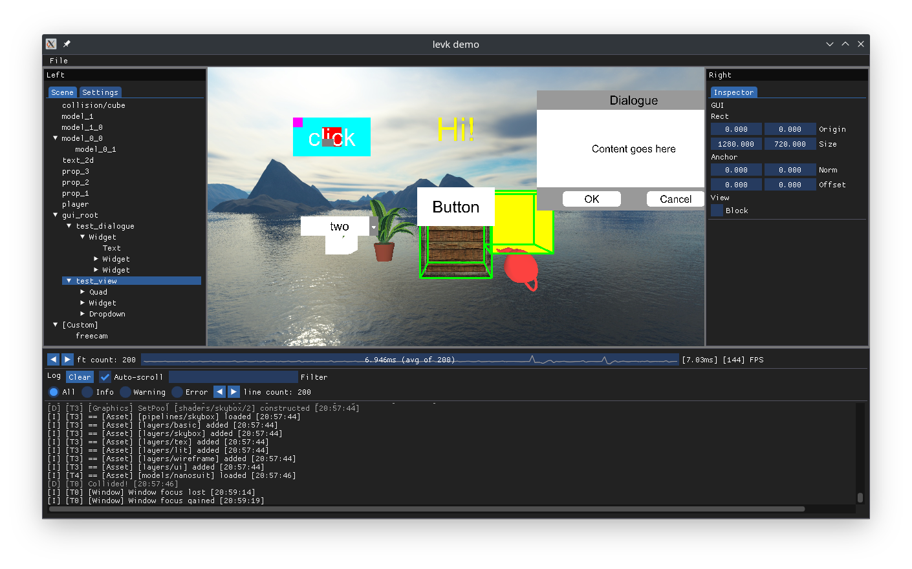

# Little Engine Vulkan

A simple C++20 3D game engine using a customizable Vulkan renderer.

[Documentation](https://karnkaul.github.io/levk-docs) is located here (WIP).

 

### Features

- `window`
  - Multi-platform windowing
    - Windows, Linux: via GLFW
  - Keyboard, mouse, and gamepad support
- `graphics`
  - Bootstrapped Vulkan render context
  - Customizable renderer
    - Built-in swapchain and off-screen renderers
  - Customizable device selection
  - Deferred resource release
  - Dedicated transfer queue, async transfers
  - Shader reflection via SPIR-V Cross
  - Automatic swapchain resize management
  - Automatic descriptor set management
  - Stall-less API (except during swapchain resize)
  - Validation layer support (on by default in `Debug`)
  - sRGB and linear colour spaces
- `engine`
  - Thread-safe `AssetStore`
    - Multi-reader single-writer API
    - Store any `T` associated with a lightweight `io::Path` ID
    - Customizable asset loaders
    - Asset hot reload support
  - Customizable Editor
  - Bitmap Fonts and 2D Text
  - GUI view/widget trees
  - Basic 3D AABB collision detection
- `libs/*`
  - Multi-threaded task scheduler
  - Entity-Component framework
  - JSON parser, de/serializer
  - Formatted logger

### Limitations

- No CMake install stage / `find_package` support (as yet)
- No dynamic library support on Windows
- Single draw command buffer

### Requirements

- CMake 3.14+
- Git
- C++20 compiler and stdlib (modules, coroutines, and ranges are not yet used)
- OS with desktop environment and Vulkan loader (`libvulkan1.so` / `vulkan1.dll`)
  - Windows 10
  - Linux: X, Wayland (untested)
- GPU supporting Vulkan 1.0+, its driver, and loader
- Vulkan SDK / `glslc` and validation layers (for compiling glsl shaders to SPIR-V in Debug and debugging / development)

### Usage

LittleEngineVk (`levk-engine`) is a library intended to be built from source and linked statically, it currently does not support any installation / packaging. At present it ships with one hacked-together `levk-demo` application as an example, which will be split up and expanded upon in the future.

#### Building `levk-demo`

- Clone this repo (manually initializing git submodules is not required, it will be done by the CMake script)
- Use CMake and a generator of your choice to configure an out-of-source build (`build` and `out` are ignored in git)
- If using CMake 3.20+ / Visual Studio in CMake mode / CMake Tools with VSCode, `cmake/CMakePresets.json` can be copied/symlinked to the project root for convenience
  - Use `cmake --preset <name>` to configure and `cmake --build --preset <name>` to build on the command line
  - VS CMake and VSCode CMake Tools should pick up the presets by themselves
  - The presets are not checked into the repo root since some IDEs/editors force its usage if present there
- For other scenarios, use CMake GUI or the command line to configure and generate a build
  - Command line: `cmake -S . -B out`
  - If using an IDE generator, open the project/solution in the IDE and build/debug as usual
  - Build on the command line via `cmake --build out`

### External Dependencies

- [{fmt}](https://github.com/fmtlib/fmt)
- [GLFW](https://github.com/glfw/glfw)
- [glm](https://github.com/g-truc/glm)
- [Dear ImGui](https://github.com/ocornut/imgui)
- [PhysicsFS](https://icculus.org/physfs/)
- [stb](https://github.com/nothings/stb)
- [tiny-obj-loader](https://github.com/tinyobjloader/tinyobjloader)
- [VulkanHPP](https://github.com/KhronosGroup/Vulkan-Hpp)
- [Vulkan Memory Allocator](https://github.com/GPUOpen-LibrariesAndSDKs/VulkanMemoryAllocator)
- [SPIR-V Cross](https://github.com/KhronosGroup/SPIRV-Cross)

### CMake submodules

- [ktl](https://github.com/karnkaul/ktl)
- [dtest](https://github.com/karnkaul/dtest)

[Original repository](https://github.com/karnkaul/LittleEngineVk)

[LICENCE](LICENSE)
