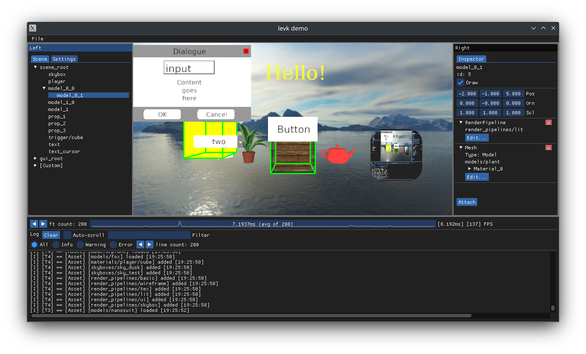

# Little Engine Vulkan

An attempt to write a simple 3D game engine with a (mostly hard-coded) Vulkan renderer.

[Documentation](https://karnkaul.github.io/levk-docs) is located here (WIP).

[](https://ci.appveyor.com/project/karnkaul/littleenginevk)



### Features

- Multi-platform windowing
  - Windows, Linux: via GLFW
  - Android (alpha)
  - Keyboard, mouse, and gamepad support
- Bootstrapped Vulkan context
  - Customizable device selection
  - Dedicated transfer queue, async transfers
  - Shader reflection via SPIR-V Cross
  - Automatic descriptor Set management
  - Validation layer support (on by default in `Debug`)
- Asset Store
  - Store any `T` associated with a lightweight `io::Path` ID
  - Customizable asset loaders
  - Asset hot reload support
- Multi-threaded task scheduler
- Entity-Component framework
- JSON de/serialisation
- Customizable Editor (powered by Dear ImGui)

### Limitations

- No dynamic library support on Windows
- Single window instance
- Single draw command buffer
- Hard-coded single render pass (for time being)

### Usage

- Clone this repo (manually initialising git submodules is not required, it will be done by the CMake script)
- Use CMake and a generator of your choice

```
# Examples
cmake -G Ninja -DCMAKE_C_COMPILER=clang -DCMAKE_CXX_COMPILER=clang++ . -B out/Debug
# OR
cmake . -B out/Debug
ccmake out/Debug
```

- Adjust CMake variables as needed: all variables pertaining to this project are prefixed with `LEVK`
- Build engine / demo / tests

```
cmake --build out/Debug
```

- Debug/Run desired executables / Link `levk-engine` to custom application

[Original repository](https://github.com/karnkaul/LittleEngineVk)

[LICENCE](LICENSE)
